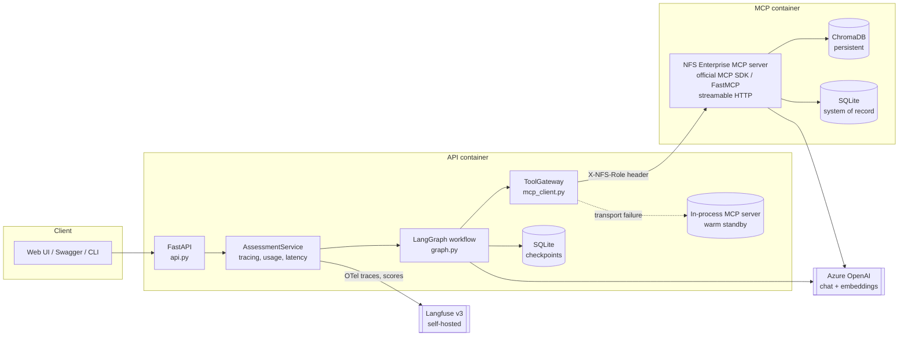
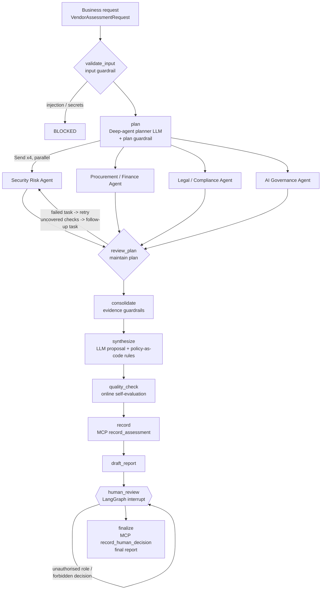

# Architecture — NFS Vendor Risk & Procurement Deep Agent

A controlled, evidence-grounded **deep agent**. It plans, delegates to four specialist agents, and
retrieves evidence through **MCP**. It passes every model output through **deterministic guardrails**
and stops for an authorised **human** before any final decision. It is **not** a single prompt → answer chatbot.

## 1. Component view

## 2. Workflow (LangGraph state machine)

| Stage (handout §3) | Node / module | Notes |
|---|---|---|
| Business Request | `validate_input`, `schemas.VendorAssessmentRequest` | Typed request (FR01); injection and secrets screening |
| Deep Agent Planner / Task Plan | `plan` → `agents.make_plan` + `enforce_plan` | LLM plan with typed tasks; the guardrail makes sure all four mandatory domains are covered, corrects wrong delegation and adds the baseline control library. The template plan is the fallback |
| RAG over Enterprise Knowledge | `rag.py` (ChromaDB) behind MCP `search_*` tools | Section-level chunks with policy IDs and trust labels |
| MCP Tools / Enterprise Resources | `mcp_server.py`, `mcp_client.py` | 9 tools and 2 resources, access by role |
| Specialist execution | `specialist` → `agents.run_specialist` | LangChain `create_agent` ReAct loop with `ToolStrategy(DomainAssessment)` and a call budget |
| Plan maintenance | `review_plan` | Marks each task completed or failed, retries failed tasks, and creates follow-up tasks for checks nobody covered (bounded by `MAX_PLAN_ITERATIONS`) |
| Evidence Consolidation | `consolidate` | Merges results, verifies citations, forces UNKNOWN where evidence is missing, detects inter-agent disagreement |
| Guardrails / Policy Checks | `guardrails/decision_rules.py` | Rules R01–R10, each tied to an NFS policy clause |
| Risk & Recommendation | `synthesize` | LLM draft → rules constrain it → output guardrail on the executive summary |
| Evaluation | `quality_check` (online) + `evaluation/run_eval.py` (offline suite) | Scores go to Langfuse |
| Human Review / Final Report | `human_review` (interrupt) → `finalize` | Role-based sign-off, recorded through a human-only MCP tool |

## 3. MCP server (official MCP Python SDK)

| Tool / resource | Purpose | Allowed roles |
|---|---|---|
| `search_policy` | RAG over NFS policies | all specialists, evaluator |
| `search_vendor_documents` | RAG over vendor submissions (untrusted) | all specialists, evaluator |
| `retrieve_document` | All sections of one document | all specialists, evaluator |
| `list_documents` / `nfs://documents` | Corpus catalogue (tool + resource) | specialists, orchestrator |
| `get_vendor_history` | Historical assessments + prior recorded runs | all specialists |
| `calculate_tco` | Deterministic TCO maths | procurement_agent |
| `record_assessment` | Writes to the system of record as PENDING_HUMAN_REVIEW | orchestrator |
| `get_prior_assessments` | System-of-record lookup | orchestrator, human roles |
| `record_human_decision` | **Final** decision | executive_risk_owner, vendor_risk_manager — **never an agent** |

The caller's identity travels in the `X-NFS-Role` header (streamable HTTP) or is bound to the in-process server.
Authorisation is enforced **twice**: agents only receive the tools on their allow-list, and the server checks
every call again. In production this would be an OAuth token under the MCP authorization spec.

**Failure handling (FR14):** every agent's `ToolGateway` keeps an in-process MCP server as a warm standby.
- If the remote server can't be reached at start, the agent runs on the in-process server.
- If a call fails at transport level (or the server returns `SERVICE_UNAVAILABLE`), that call is retried on the in-process server.
- Remote calls use short-lived per-call sessions, so a server dying mid-run cannot cancel the agent.

The run is flagged as *degraded* in the report and in the traces. Tool errors come back to the model as
structured errors that tell it to record UNKNOWN. An agent that fails outright yields a fail-safe
all-UNKNOWN assessment and is retried by the planner. If no LLM is reachable at all, the result is still a
safe, human-gated REJECT.

## 4. Guardrails (defence in depth)

| Layer | Where | What it does |
|---|---|---|
| Input | `guardrails/input.py` | Blocks prompt injection and Restricted material (secrets) in requests |
| Plan | `agents.enforce_plan` | Ensures all mandatory domains are covered, delegation is correct and baseline checks are present |
| Tool access | `guardrails/access.py` (client and server) | Least-privilege, role-based access; human-only tools |
| Retrieved content | `guardrails/injection.py` via `ToolGateway._guard_result` | Detects injection patterns and quarantines the text before any model sees it; the ledger keeps the original for audit |
| Prompting | `prompts.py` | Tool output is framed as untrusted data; citations are mandatory |
| Evidence | `guardrails/evidence.py` | A citation is valid only if its chunk was retrieved in this run **and** the quote is found in it (numbers must match exactly). Unverified RETRIEVED claims are downgraded; missing evidence is never PASS; an unverified PASS counts as UNKNOWN |
| Decision | `guardrails/decision_rules.py` | Policy-as-code rules R01–R10 bound the recommendation and risk, set required approvers and require human sign-off |
| Output | `report.guard_summary` | Regenerates the executive summary if it contradicts the validated decision or contains injected text |
| Human | `graph.human_review`, `api.review` | Checks the approver's role against the risk level; only decisions the rules permit can be recorded |

Policy rules: R01 VR-006 §2 (a mandatory failure makes the rating HIGH) · R02 IS-010 §8 · R03 VR-006 §4 / PR-001 §7
(UNKNOWN is not PASS) · R04 VR-006 §3 (APPROVE only if all mandatory controls pass) · R05 VR-006 §3 (a failure that
can't be fixed contractually means REJECT) · R06 DC-002 §4 (Restricted data means REJECT) · R07 AI-004 §5
(injection found in evidence) · R08 VR-006 §4 (a failed domain makes the run fail safe) · R09 PR-001 §2–4 (approval
chain) · R10 AI-004 §6 / PR-001 §4 / VR-006 §5 (human approval).

These rules encode **policy**, not answers. Every status they act on comes from evidence retrieved in the run.

## 5. Typed contracts

All components exchange Pydantic models (`schemas.py`). The main ones:

- `VendorAssessmentRequest`, `AssessmentPlan` / `PlanTask` / `CheckItem`.
- `DomainAssessment` / `Finding` / `Citation`, where each finding has a `status` (PASS · PARTIAL · FAIL · UNKNOWN) and an `evidence_basis` (RETRIEVED · INFERRED · MISSING).
- `RiskDecisionDraft` (the LLM's proposal) → `RiskDecision` (validated).
- `HumanDecision`, `QualityMetrics`.

Fields computed by guardrails are excluded from the JSON schemas the LLM sees (`SkipJsonSchema`).

## 6. Observability

- **Langfuse v3 (self-hosted, OpenTelemetry SDK)** traces each run: one trace per phase (assessment and human review), grouped by `session_id = assessment_id`. A trace contains:
  - the AGENT root, a CHAIN span per workflow node, and GENERATION spans with token usage;
  - MCP TOOL calls, GUARDRAIL spans (policy rules) and an EVALUATOR span (online quality check);
  - scores such as citation validity, groundedness, coverage and recommendation. The offline evaluation attaches its metrics to the same trace.
- **Structured JSON events** go to stdout: `tool_call`, `mcp_fallback`, `injection_quarantined`, `plan_revised`, `specialist_failed`, `human_review_rejected`, `run_finished` and others. Read them with `docker compose logs` (see `deployment/`).

## 7. Key design decisions

- **LangGraph plus specialist agents built with `create_agent`**, instead of a free-form orchestrator LLM. Planning and delegation stay dynamic (the LLM plans; review_plan re-plans), but the guardrail and human checkpoints sit at fixed points the LLM cannot skip.
- **Section-level chunking** (one numbered policy clause per chunk). Chunk IDs such as `information-security-policy::6` double as human-readable citations (IS-010 §6).
- **Deterministic citation verification** instead of trusting the model's citations. An optional LLM-as-judge in the evaluation suite measures semantic support.
- **Fail safe over fail open.** Missing evidence becomes UNKNOWN, a failed agent is treated as HIGH risk, and an LLM outage produces a REJECT that still goes to a human.
